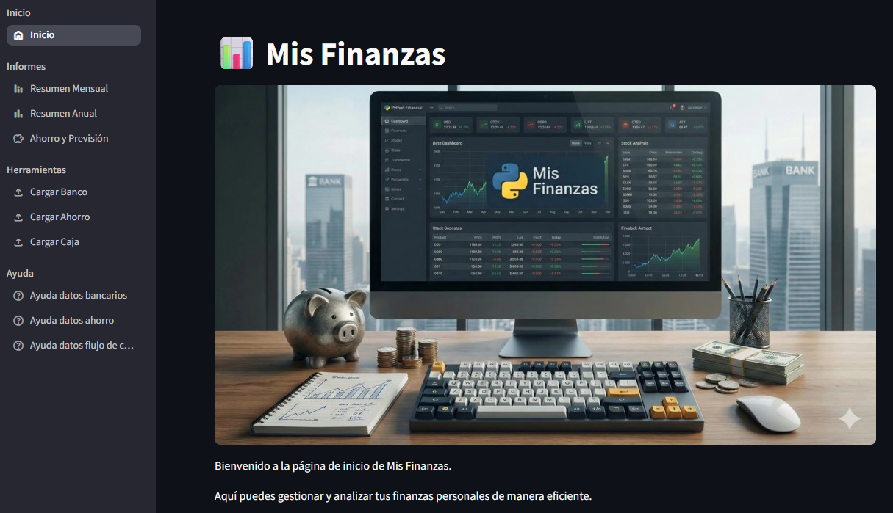
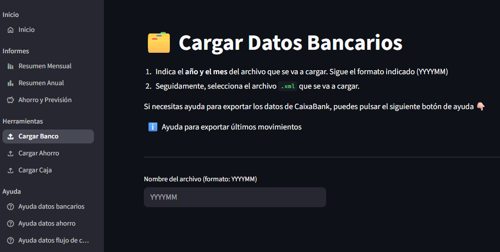

# Mis Finanzas

Aplicación interactiva desarrollada en **Python** utilizando el framework [Streamlit](https://github.com/streamlit/streamlit) para la gestión exhaustiva y visual de las finanzas personales.

Está pensada, de momento, para mostrar datos del banco __CaixaBank__.

No requiere:

- Conectar con el banco
- Conectar con ninguna API
- Conectar con ningún servicio en la nube

Todo lo necesario para su funcionamiento es mediante archivos locales y descargas manuales de la web del banco, así como de los seguros de ahorro.

## Objetivo

El objetivo principal de la aplicación es consolidar la información financiera procedente de distintas fuentes (cuentas bancarias -CaixaBank-, ahorros -Fiatc y Axa- y efectivo o caja) para ofrecer un resumen detallado y visual que facilite el análisis y la toma de decisiones económicas.

## Características y Opciones de la Aplicación

La aplicación está organizada en diferentes secciones para facilitar su uso:

### 🏠 Inicio
Pantalla principal de bienvenida a la aplicación.

### 📊 Informes
- **Resumen Mensual:** Análisis detallado de los ingresos y gastos mes a mes.
- **Resumen Anual:** Perspectiva general e indicadores clave agrupados por año.
- **Ahorro y Previsión:** Seguimiento del estado actual de los ahorros y proyecciones a futuro.

### 🛠️ Herramientas
- **Cargar Banco:** Importa y procesa los movimientos bancarios de una cuenta de __CaixaBank__ descargándola desde __CaixaBankNow__.
- **Cargar Ahorro:** Carga e integra los datos de los depósitos o planes de ahorro de __Fiatc__ y __Axa__, ficheros de confección completamente __manual__.
- **Cargar Caja:** Registro y actualización del flujo de efectivo o caja, confección completamente __manual__.

### ❓ Ayuda
Secciones de consulta con información relevante sobre el formato y la estructura esperada para cada tipo de dato a importar:
- **Ayuda datos bancarios:** Instrucciones para los archivos de movimientos bancarios desde la web de __CaixaBankNow__.
- **Ayuda datos ahorro:** Instrucciones para los datos de ahorro aportados de __Fiatc__ y __Axa__. Es un fichero completamente __manual__.
- **Ayuda datos flujo de caja:** Instrucciones para el registro de movimientos en caja. Es un fichero completamente __manual__.

## 🌍 Internacionalización (i18n)

La aplicación soporta múltiples idiomas de manera transparente (actualmente Español e Inglés) gracias a un sistema de internacionalización basado en diccionarios. 
- A través del directorio `i18n/`, se gestionan las traducciones en archivos `.json` separados (como `es.json` y `en.json`).
- Mediante la clase `Locale`, la aplicación detecta el idioma del cliente/navegador definido en Streamlit y carga los textos correspondientes que se visualizan en todas las pantallas.

## Instrucciones de Instalación Local

Para ejecutar este proyecto en tu máquina local, sigue estos pasos recomendados utilizando un entorno virtual.

### 1. Clonar el repositorio
Si aún no lo has hecho, clona el proyecto y entra en su directorio:
```bash
git clone <URL_DEL_REPOSITORIO>
cd MisFinanzas
```

### 2. Crear y activar un entorno virtual
Se recomienda el uso de un entorno virtual para aislar las dependencias del proyecto. Crea y activa el entorno según tu sistema operativo:

**En Windows:**
```powershell
python -m venv .venv
.\.venv\Scripts\activate
```

**En macOS/Linux:**
```bash
python3 -m venv .venv
source .venv/bin/activate
```

### 3. Instalar las dependencias
Una vez que el entorno virtual esté activado (verás un `(.venv)` en la línea de comandos), instala las librerías requeridas incluidas en el archivo `requirements.txt`:
```bash
pip install -r requirements.txt
```

### 4. Iniciar la aplicación
Para comenzar a utilizar la aplicación localmente, inicia el servidor de Streamlit usando el siguiente comando:
```bash
streamlit run app.py
```
Tras ejecutar este comando, la aplicación se abrirá automáticamente en una nueva pestaña de tu navegador web predeterminado (por lo general en `http://localhost:8501`).

## Instrucciones de Instalación con Docker

También puedes ejecutar la aplicación utilizando Docker, lo cual simplifica la configuración del entorno.

### 1. Construir la imagen Docker
Asegúrate de estar en el directorio raíz del proyecto y ejecuta el siguiente comando para construir la imagen:
```bash
docker build -t misfinanzas .
```

### 2. Ejecutar el contenedor
Para iniciar la aplicación de forma contenerizada, ejecuta el siguiente comando. Es muy importante mapear el puerto y configurar los volúmenes necesarios para conservar o intercambiar los datos de tus finanzas:

```bash
docker run -d \
  -p 8501:8501 \
  -v /ruta/local/a/data:/app/data \
  -v /ruta/local/a/raw:/app/raw \
  --name misfinanzas-app \
  misfinanzas
```

**Nota sobre los volúmenes:**
- **`data`** mapeado a **`/app/data`**: Directorio donde se almacena la información consolidada de los datos (normalmente archivos `.parquet` o bases de datos).
- **`raw`** mapeado a **`/app/raw`**: Directorio que contiene los archivos en crudo importados directamente de los bancos o registros en caja.

*Nota: Asegúrate de reemplazar `/ruta/local/a/...` por las rutas absolutas donde desees almacenar la información en tu equipo anfitrión.*

### 3. Acceder a la aplicación
Una vez que el contenedor esté en ejecución, abre tu navegador web y dirígete a `http://localhost:8501`.

## Capturas de Pantalla

> Las capturas de pantalla muestran datos de ejemplo, no son datos reales.

### Inicio


### Pantalla de resumen mensual


### Pantalla de carga de datos
